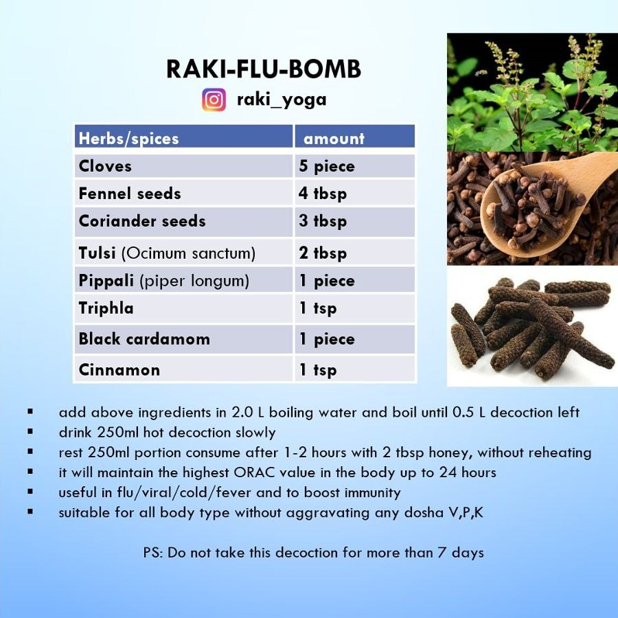

Embrace the wisdom of Ayurveda and nourish your body, mind, and soul with these delicious and healing recipes. Whether you're looking to boost your immunity, balance your doshas, or simply savor the flavors of the season, these Ayurvedic dishes will leave you feeling rejuvenated and in harmony with nature. 

Ayurvedic Recipes	Incorporate 6 tastes to satisfy senses and promote health:
Sweet (Madhura), Sour (Amlā), Salty (Lavana), Pungent (Katu), Bitter (Tikta), Astringent (Kashaya)

**Spices as a Catalyst** : Use herbs and spices to catalyze nutrients, improve bioavailability, and provide anti-inflammatory and immune-enhancing effects. Incorporating spices as per your per food, not only elevates flavor but also maximizes health benefits. Cooking with spices enhances agni(digestive fire), which is essential for strong immunity.

**Dosha Balancing** : Understanding your unique dosha constitution allows for an individualized dietary approach. Tailoring your diet to balance vata, pitta, and kapha can promote optimal health and well-being. Eating seasonal produce aligns your diet with nature’s cycles, promoting balance and well-being. 

---

Anti allergic soup

This soup recipe is to modulate your immunity and balance your doshas. Stinging nettle / Brennnesseln (Urtica dioica) has anti-allergic, antihistamine, anti-inflammatory, and sinus-clearing properties when combined with other herbs. It provides first aid for allergic rhinitis and seasonal allergies. Nettle increases ojas (vitality) and acts as a nourishing tonic, especially for the kidneys and adrenals. It reduces excess pitta (heat) in the blood and lymph, helping to clear inflammatory skin conditions.

---

Sprouts & Raw foods

They are ideal for breakfast from late spring to summer's end, especially for Pitta person. Those with weaker agni (digestive fire) can enhance digestibility with fresh ginger, black pepper, or long pepper. To improve flavour, add himalaya salt, coriander/parsley, and lemon juice and olive oil.

---

Wild garlic(Bärlauch) Pesto

Ayurveda aligns its new year with the arrival of a new season, typically spring. During this time, the plants that naturally emerge help to reduce the accumulated Kapha from the previous winter season.
A prime example of such a spring plant is wild garlic, also known as Bärlauch or Wunderlauch (Allium ursinum & Allium paradoxum). To make a delicious wild garlic pesto, combine 200g of the fresh buds with 50ml of pomegranate vinegar, 200g of roasted almond nuts, and 500ml of olive oil.
This pesto can be stored for up to 3 years, provided no water droplets get inside the container. The vinegar and oil help preserve the pesto, making it a versatile condiment to enjoy throughout the year.

---

Raki-Flu-bomb decoction 

Recipe for any kind of flu, virus, bacteria with below recipe. 

---
Additional recipes are currently being updated!
